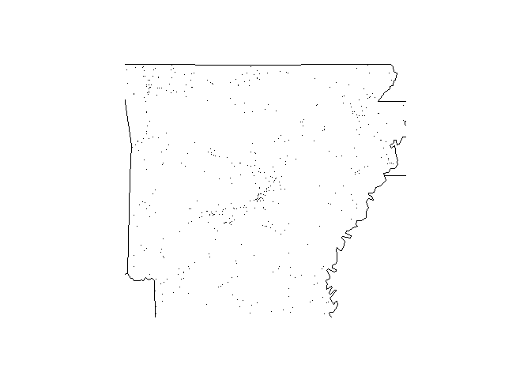

<!-- badges: start -->

[](https://travis-ci.com/PatGruetter/FARSPackage)
<!-- badges: end -->

<!-- README.md is generated from README.Rmd. Please edit that file -->

# FARSPackage

<!-- badges: start -->

<!-- badges: end -->

The goal of FARSPackage is to display information on the US National
Highway Traffic Safety Administration’s Fatality Analysis Reporting
System (FARS) for the years 2013, 2014 and 2015.

## Installation

You can install the released version of FARSPackage from
[CRAN](https://CRAN.R-project.org) with:

``` r
install.packages("FARSPackage")
```

And the development version from [GitHub](https://github.com/) with:

``` r
# install.packages("devtools")
devtools::install_github("PatGruetter/FARSPackage")
```

## Example

Example 1)

``` r
library(FARSPackage)
fars_summarize_years(2014:2015)
#> # A tibble: 12 x 3
#>    MONTH `2014` `2015`
#>    <dbl>  <int>  <int>
#>  1     1   2168   2368
#>  2     2   1893   1968
#>  3     3   2245   2385
#>  4     4   2308   2430
#>  5     5   2596   2847
#>  6     6   2583   2765
#>  7     7   2696   2998
#>  8     8   2800   3016
#>  9     9   2618   2865
#> 10    10   2831   3019
#> 11    11   2714   2724
#> 12    12   2604   2781
```

Example 2)

``` r
fars_map_state(5,2015)
```


